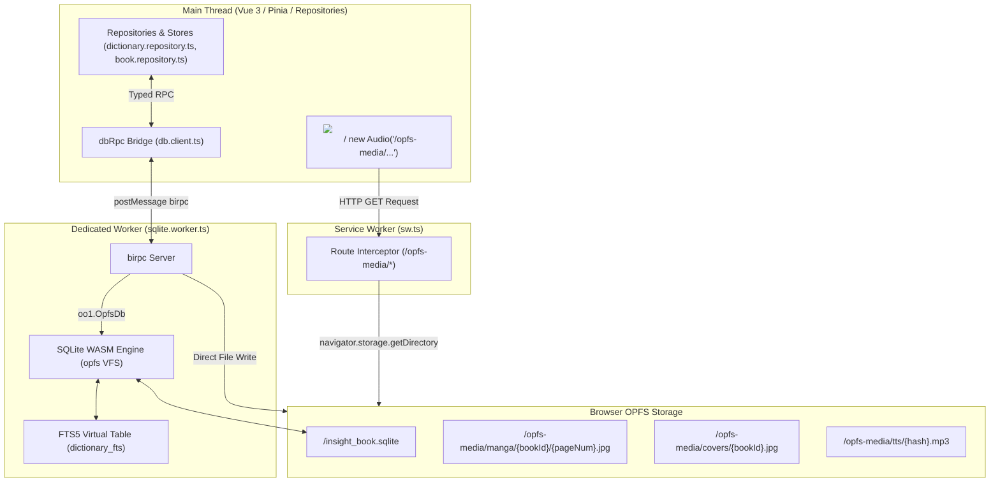

# Архитектура Оффлайн-хранилища InsightBook

В InsightBook оффлайн-слой полностью построен на сочетании **SQLite WASM**, **Origin Private File System (OPFS)**, **Dedicated Web Worker** с **birpc**, и **Service Worker**.

IndexedDB, localForage и CacheStorage для медиа-данных **не используются**.

## 1. Схема Архитектуры

## 2. Основные Компоненты

### A. Dedicated SQLite Worker (`sqlite.worker.ts`)
- **Среда:** Dedicated Web Worker.
- **Движок:** `@sqlite.org/sqlite-wasm` в режиме OPFS VFS (`sqlite3.oo1.OpfsDb('/insight_book.sqlite')`).
- **Таблицы:** `books`, `pages`, `dictionary`, `dictionary_fts`, `decks`, `highlights`, `analyses`, `settings`.
- **FTS5:** Индекс полнотекстового поиска с триггерами автосинхронизации (`dictionary_ai`, `dictionary_ad`, `dictionary_au`).
- **Транзакции:** Пакетная запись страниц книги (`savePagesBatch`) и словаря выполняет вызовы в рамках единого блока `BEGIN TRANSACTION; ... COMMIT;`.

### B. Typed RPC Bridge (`db.client.ts` & `rpc.ts`)
- Двунаправленный RPC на базе `birpc`.
- Прокси-клиент `dbRpc` предоставляет строго типизированный интерфейс для всех репозиториев.
- Поддерживает обратные вызовы с прогрессом (`onSyncProgress`) для полос загрузки.

### C. OPFS Media Storage & SW Interceptor
- Все тяжелые медиафайлы (страницы манги, обложки книг, аудио TTS) пишутся в OPFS по виртуальному пути `/opfs-media/...`.
- Service Worker (`sw.ts`) перехватывает запросы `/opfs-media/.*`, считывает файлы из OPFS и отдаёт их в виде стрима/ответа со специальными заголовками кэширования.
- В компонентах Vue **не требуется управление `URL.createObjectURL` или blob URL**.

### D. Функция "Скачать полный словарь" (`ATTACH DATABASE`)
- Воркер скачивает серверный `.sqlite` файл в OPFS.
- Подключает через `ATTACH DATABASE 'public_dict.sqlite' AS remote;`.
- Сливает слова: `INSERT OR IGNORE INTO main.dictionary SELECT * FROM remote.dictionary;`.
- Распаковывает архив аудио через `fflate` в `/opfs-media/tts/`.

## 3. Правила для Разработчиков и Нейросетей
1. **Никакого IndexedDB и localForage:** Не импортируйте `localforage` или IndexedDB API.
2. **Никакого кэширования бинарников в Cache API / Service Worker:** Видео, аудио и книги не должны помещаться в `CacheStorage`. Только OPFS.
3. **Фильтрация только через SQL / FTS5:** Не загружайте массив словаря в память для фильтрации в JS. Используйте `dbRpc.getDictionary({ query, deckId, state, limit, offset })`.
