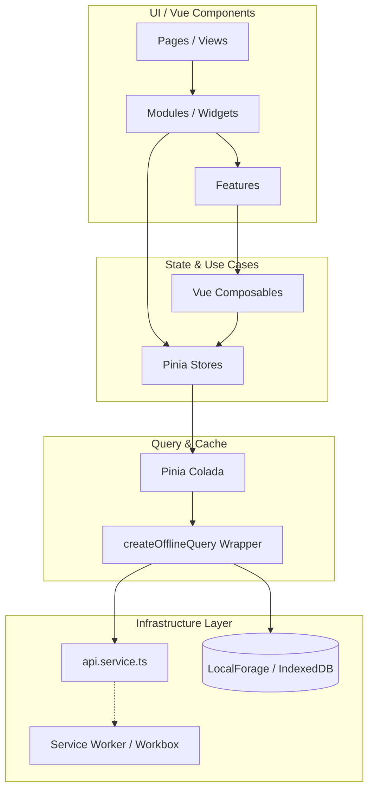
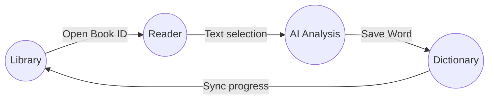
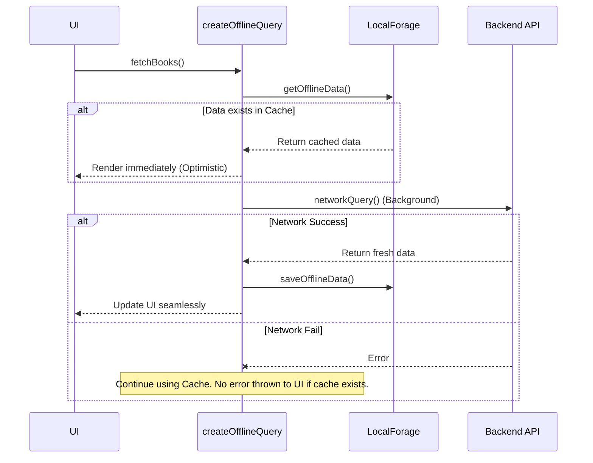

# 🏗 Архитектура проекта InsightBook

InsightBook — это современное кроссплатформенное (PWA / Tauri) приложение для чтения книг и изучения языков. Архитектура проекта построена на гибридном подходе, объединяющем **Feature-Sliced Design (FSD)**, **Modular Architecture**, принципы **Domain-Driven Design (DDD)** и мощную стратегию **Offline-First**.

Ниже приведено подробное описание того, как организован код, как движутся данные и какие паттерны используются.

---

## 📑 Оглавление
1. [Высокоуровневая архитектура](#1-высокоуровневая-архитектура)
2. [Структура проекта (Feature-Sliced Design)](#2-структура-проекта)
3. [Ограниченные контексты (Bounded Contexts)](#3-ограниченные-контексты)
4. [Управление состоянием и данными (CQRS & Colada)](#4-управление-состоянием)
5. [Стратегия Offline-First и Кэширование](#5-стратегия-offline-first)
6. [Плагинная система (Microkernel)](#6-плагинная-система)
7. [Ключевые принципы (SOLID, DRY, KISS)](#7-ключевые-принципы)
8. [Продвинутые архитектурные паттерны](#8-продвинутые-архитектурные-паттерны)

---

## 1. Высокоуровневая архитектура

Приложение разделено на четкие слои ответственности. UI не делает прямых запросов в сеть, а бизнес-логика (Composables / Stores) отделена от инфраструктуры (API / LocalForage / Service Workers).



---

## 2. Структура проекта

Проект организован по адаптированной методологии **Feature-Sliced Design (FSD)**. Это обеспечивает предсказуемость, модульность и строгий контроль зависимостей (нижние слои не могут импортировать верхние).

```text
src/
├── components/
│   ├── 01.kit/          # UI-кит (dumb-компоненты: кнопки, инпуты, модалки)
│   ├── 02.shared/       # Общие переиспользуемые UI-блоки (Titlebar, Loader, Toast)
│   ├── 03.domain/       # Бизнес-сущности и привязанный к ним UI (DictWord, Analysis)
│   ├── 04.features/     # Пользовательские сценарии (Авторизация, Глобальные экшены)
│   ├── 05.modules/      # Сложные модули / Виджеты (Reader, Dictionary, Library)
│   └── 06.layouts/      # Скелеты страниц (DefaultLayout)
├── pages/               # Маршрутизация (Vue Router views)
├── shared/              # Ядро: сервисы, типы, константы, composables, глобальные сторы
├── plugins/             # Плагинная система (Microkernel)
└── workers/             # Service Workers для PWA и кэширования статики
```

---

## 3. Ограниченные контексты (Bounded Contexts)

Согласно подходу **DDD**, приложение поделено на три основных изолированных домена (Bounded Contexts), которые находятся в `05.modules`:

1. **Library (Библиотека):** Отвечает за хранение, загрузку, метаданные книг и оглавление.
2. **Reader (Читалка):** Отвечает за рендеринг текста, пагинацию, параллельное чтение, выделение текста и TTS.
3. **Dictionary (Словарь):** Управление словарным запасом, колодами, интервальным повторением (FSRS) и квизами.

**Взаимодействие между доменами:**
Домены стараются не зависеть друг от друга напрямую. Взаимодействие происходит на уровне шины событий (Event Bus) или композиции в `pages`.



---

## 4. Управление состоянием

Мы используем паттерн, похожий на **CQRS (Command Query Responsibility Segregation)** на клиенте:
- **Состояние UI и локальные данные** лежат в `Pinia` (например, `reader.store.ts`).
- **Асинхронные данные (Сервер/БД)** управляются через `@pinia/colada` (Query/Mutation).

### Жизненный цикл Composables (Use Cases)
Сложная логика Vue-компонентов вынесена в Composables. Они выступают в роли *Use Cases* (интеракторов). 
Например: `useSrsQuiz()`, `usePanZoom()`, `useMangaBubbles()`. Компонент только вызывает методы и рисует данные.

---

## 5. Стратегия Offline-First

Одной из главных фич InsightBook является независимость от сети. Реализован кастомный враппер `createOfflineQuery`, который инкапсулирует логику общения с кэшем.

**Как работают запросы:**


### Разделение кэша:
1. **Статика (JS, CSS, Шрифты, Иконки):** Кэшируется через *Service Worker (Workbox)*.
2. **Медиа (Обложки, Манга-страницы, Аудио):** Сохраняется в *Cache API* через `offline.service.ts` для быстрой отдачи браузером.
3. **Данные (JSON, Словари, Анализ):** Сохраняется в *IndexedDB* (через `localforage`).

---

## 6. Плагинная система (Microkernel Architecture)

Приложение поддерживает расширение функционала "на лету" без изменения ядра. Для этого реализован `plugin-manager.ts`.

- **Event Bus:** Плагины могут подписываться на системные события через встроенную шину `globalEventBus` и реагировать на них (например, при выделении слова в Reader'е).
- **Экспорт UI:** Плагины могут добавлять свои страницы в Vue Router динамически на этапе инициализации (bootstrap).

---

## 7. Ключевые принципы

- **Explicit over Implicit:** Предпочтение отдается явному написанию кода (явные импорты, строгая типизация TypeScript), а не "магии".
- **Separation of Concerns (Разделение ответственности):** 
  - UI-компоненты в `01.kit` не знают о бизнес-логике.
  - API-сервисы (`api.service.ts`) не знают о Pinia.
  - Компоненты домена (`03.domain`) работают только со своими бизнес-сущностями.
- **Progressive Enhancement:** Приложение работает в браузере как веб-сайт, может быть установлено как PWA и имеет интеграцию с нативными API (Tauri) для Desktop/Android через единую кодовую базу.

---

## 8. Продвинутые архитектурные паттерны

Для обеспечения масштабируемости и чистоты кода (Clean Architecture & DDD) в проекте формализованы следующие подходы:

### 8.1 Repository Pattern & Ports and Adapters
Слой управления состоянием (Pinia) и UI изолированы от конкретной реализации работы с сетью (`api.service.ts`) и оффлайн-кэшем (`offline.service.ts`). Взаимодействие с данными происходит через единые репозитории (например, `BookRepository`). Это позволяет инкапсулировать логику "Откуда брать данные — из кэша или с сервера" (в том числе через абстракцию `createOfflineQuery`) внутри репозитория.

### 8.2 Rich Domain Model (Богатые доменные модели)
Вместо анемичных моделей (простых TypeScript-интерфейсов) бизнес-логика вынесена в классы-сущности (Entities) и чистые функции. Например, сущность `Flashcard` сама рассчитывает интервалы повторения (SRS), инкапсулируя бизнес-правила и очищая от них Vue-компоненты.

### 8.3 Dependency Inversion Principle (SOLID)
Вместо прямого жесткого импорта инфраструктурных сервисов по всему приложению используется паттерн Dependency Injection. Это делает архитектуру слабо связанной и значительно упрощает написание изолированных unit-тестов.

### 8.4 Event-Driven Architecture
Для взаимодействия слабо связанных доменов (например, `Reader` и `Dictionary`) широко используется шина событий (Event Bus). Это позволяет модулям оставаться независимыми: вместо вызовов чужих сторов модули просто отправляют и слушают события (Pub/Sub).

---
*Generated by InsightBook Architecture Team*
