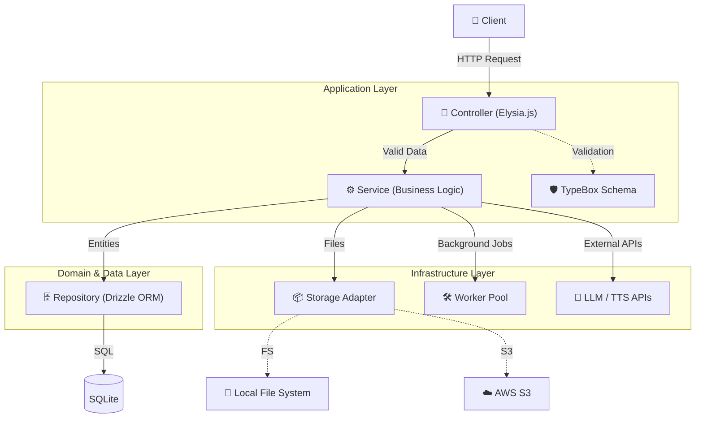
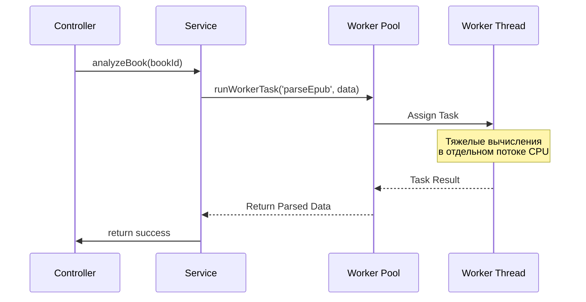
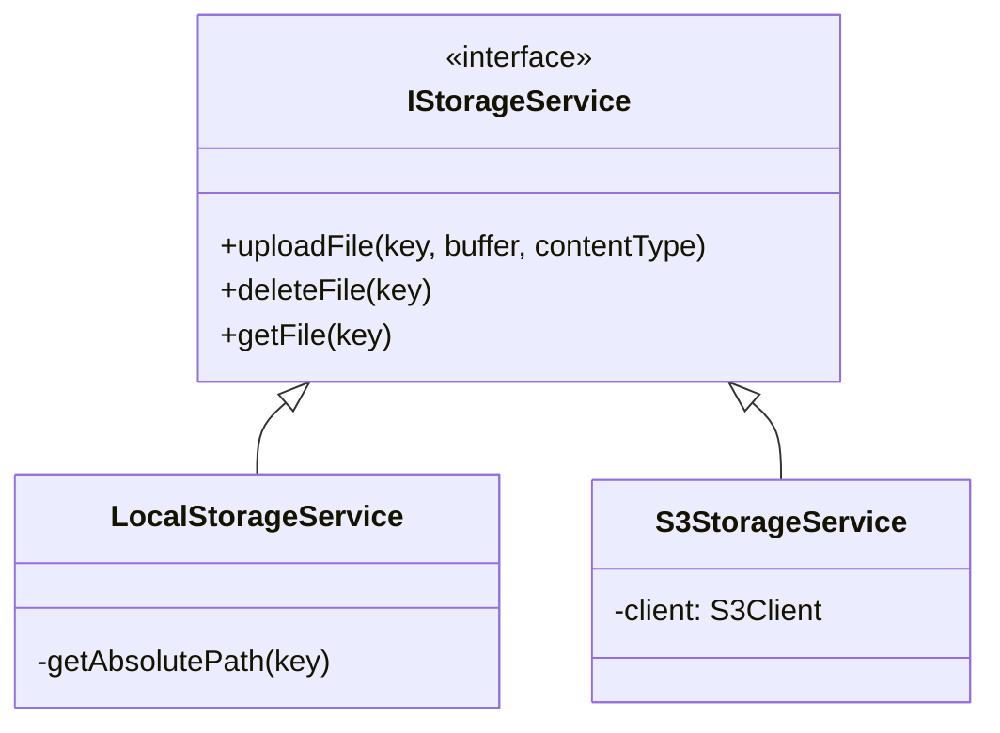

# Архитектура Серверной Части (Insight Book)

В данном документе описывается актуальная архитектура бэкенда приложения, используемые технологии, паттерны и правила разработки. Бэкенд спроектирован с упором на производительность, строгую типизацию и разделение зон ответственности.

## 📌 Технологический Стек

- **Runtime:** Bun (быстрое выполнение, нативный TypeScript)
- **Web-фреймворк:** Elysia.js (экстремально быстрый роутинг, TypeBox валидация)
- **База данных:** SQLite / Turso + Drizzle ORM
- **Многопоточность:** Worker Threads (пул воркеров для тяжелых задач)

---

## 🏗 Общая Архитектура (Layered Architecture)

Приложение построено на базе трехслойной архитектуры. Это гарантирует, что HTTP-роутинг, бизнес-логика и работа с базой данных полностью изолированы друг от друга.

---

## 📦 Описание Слоев

### 1. Controllers (`src/controllers/`)

**Ответственность:** Маршрутизация, валидация входящих данных и формирование HTTP-ответов.

- **Elysia.js & TypeBox:** Весь `body`, `query` и `params` строго валидируются через схемы Elysia (например, `t.Object`). Никаких `any` или сырых объектов.
- **Изоляция:** Контроллеры не содержат бизнес-логику. Их единственная задача — принять запрос, валидировать его, вызвать сервис и вернуть ответ (или прокинуть ошибку `AppError`).
- **Аутентификация:** Идентификатор пользователя (`userId`) автоматически извлекается из `authPlugin` через деструктуризацию: `.get('/', async ({ userId }) => { ... })`.

### 2. Services (`src/services/`)

**Ответственность:** Ядро приложения — бизнес-логика.

- **Инкапсуляция:** Сервисы ничего не знают о HTTP (нет `Request`, `Response`, заголовков).
- **Связь:** Сервисы проверяют права доступа, подготавливают данные и оркестрируют вызовы репозиториев, воркеров или сторонних API (LLM, Yandex Cloud и др.).
- **Строгая типизация:** Внутри сервисов используются конкретные типы и интерфейсы (определенные в `src/types/index.ts`). Использование `as any` запрещено.

### 3. Repositories (`src/repositories/`)

**Ответственность:** Изоляция запросов к базе данных.

- **Drizzle ORM:** Все `db.select()`, `db.insert()`, `db.update()` живут только здесь.
- **Type Safety:** Возвращаемые и принимаемые данные строго типизированы через типы Drizzle (`typeof schema.books.$inferInsert`, `typeof schema.books.$inferSelect`). Это защищает от опечаток и несоответствий схемы БД и кода.
- Сервисы не составляют SQL-запросы, они вызывают готовые методы репозиториев (например, `bookRepository.findBookById`).

---

## 🚀 Worker Pool (Многопоточность)

Бэкенд выполняет множество ресурсоемких задач: парсинг EPUB-книг, OCR (распознавание текста на картинках), NLP (обработка естественного языка и токенизация предложений). Чтобы не блокировать Event Loop основного процесса (что привело бы к зависанию HTTP-ответов для других пользователей), эти задачи вынесены в **Worker Pool**.

- Воркеры инициализируются при старте сервера (`src/index.ts`) в зависимости от количества ядер процессора.
- Общение с воркерами строго типизировано, что исключает ошибки при передаче сообщений (`postMessage`).

---

## 🔌 Паттерн Adapter (Storage)

Для загрузки файлов (обложки, манга, EPUB) мы применяем паттерн **Adapter**, что делает код независимым от физического хранилища.

В `src/services/storage/index.ts` создается экземпляр `storageService`. Если в `.env` указано `UPLOAD_STORAGE=s3`, экспортируется `S3StorageService`, иначе — `LocalStorageService`. Бизнес-логика работает исключительно с интерфейсом `IStorageService`.
