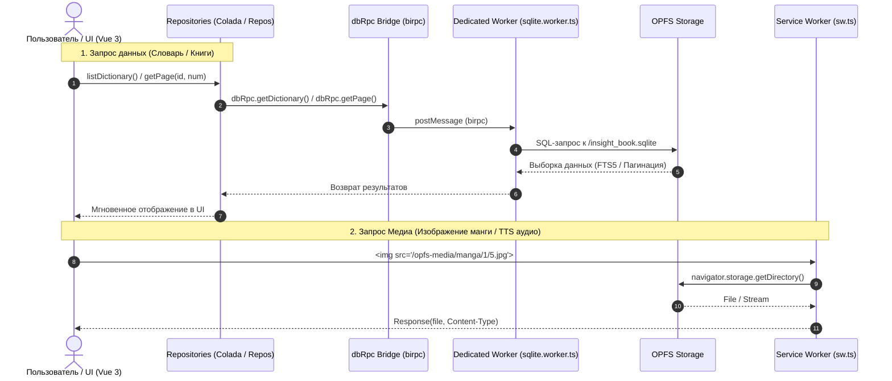

# InsightBook: Оффлайн-архитектура (SQLite WASM + OPFS + birpc)

Документ описывает устройство оффлайн-системы хранилища InsightBook.

---

## 🏗 Общая Схема Архитектуры

Приложение работает по концепции **Single Source of Truth** в локальной реляционной базе данных SQLite WASM с хранением бинарных медиаданных в OPFS (Origin Private File System).



---

## ⚡️ Ключевые Преимущества и Решения

### 1. Отказ от IndexedDB и `localForage`
- **Проблема:** IndexedDB при десериализации больших объемов Base64 и объектов словаря нагружал Main Thread и приводил к постоянным паузам Garbage Collector.
- **Решение:** Данные хранятся в реляционной SQLite файле прямо в OPFS (`/insight_book.sqlite`). Поиск слов и пагинация выполняются через FTS5 на уровне SQL без загрузки всего словаря в JS-память.

### 2. Медиачерез OPFS и Service Worker
- **Проблема:** Использование `URL.createObjectURL(blob)` приводило к утечкам памяти в SPA при переключении страниц книги.
- **Решение:** Файлы пишутся синхронно в OPFS через Dedicated Worker. Сервис-воркер перехватывает маршруты вида `/opfs-media/*` и отдаёт файл напрямую в тег `` или `new Audio()`.
- Управление жизненным циклом blob-ссылок в компонентах **полностью ликвидировано**.

### 3. Быстрые пакетные транзакции (`BEGIN TRANSACTION`)
- При скачивании книги (`startWholeBookSync`) все 1000 страниц записываются в базу в рамках **одной SQLite транзакции**, что занимает 30–50 миллисекунд.

---

## 📂 Структура Таблиц БД

```sql
-- Книги
CREATE TABLE books (
  id INTEGER PRIMARY KEY,
  title TEXT NOT NULL,
  author TEXT,
  cover_url TEXT,
  local_cover_url TEXT,
  file_path TEXT,
  language TEXT,
  total_pages INTEGER,
  current_page INTEGER,
  created_at TEXT,
  updated_at TEXT,
  toc_json TEXT,
  stats_json TEXT,
  raw_json TEXT
);

-- Страницы читалки
CREATE TABLE pages (
  book_id INTEGER,
  page_num INTEGER,
  content TEXT,
  page_dict_json TEXT,
  type TEXT,
  image_url TEXT,
  local_image_url TEXT,
  image_width INTEGER,
  image_height INTEGER,
  ocr_blocks_json TEXT,
  PRIMARY KEY (book_id, page_num)
);

-- Полнотекстовый поиск FTS5 для словаря
CREATE VIRTUAL TABLE dictionary_fts USING fts5(
  word,
  translation,
  transcription,
  tags,
  content='dictionary',
  content_rowid='id'
);
```

---

## 🔄 Скачивание Полного Словаря (`ATTACH DATABASE`)


