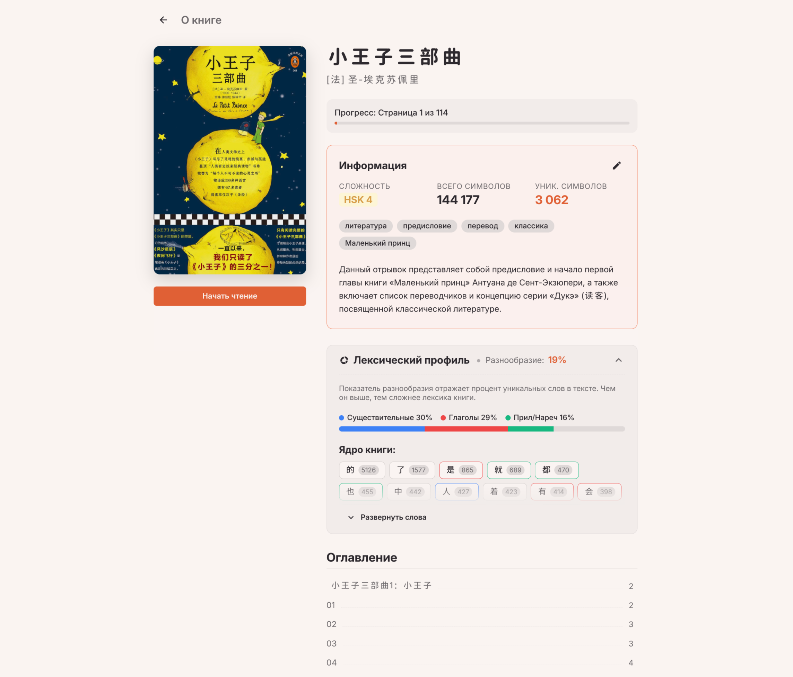
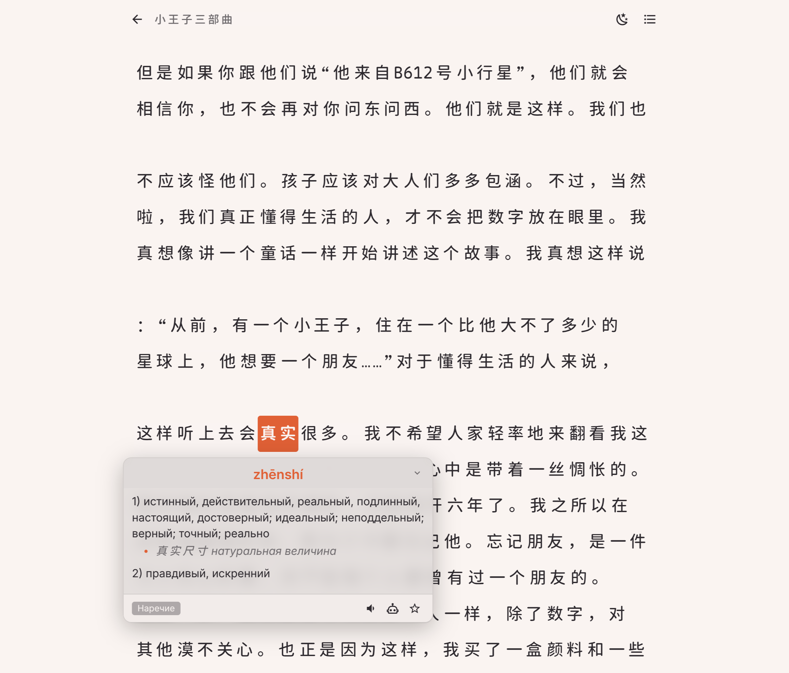

# 🌍 Insight Book

**Insight Book** — это умная библиотека и EPUB-читалка, созданная специально для изучающих иностранные языки. Приложение не просто открывает книги, но и "понимает" их текст, разбивая его на слова, предоставляя контекстный ИИ-перевод, грамматический анализ и возможность прослушивания (TTS).


## ✨ Ключевые возможности

*   📖 **Умная читалка EPUB**: Загружайте свои книги. Приложение автоматически разобьет текст на страницы, извлечет оглавление и обложки.
*   🧠 **Глубокий ИИ-анализ (LLM)**: Выделите предложение или нажмите на слово, чтобы получить:
    *   Контекстный перевод.
    *   Разбор грамматических конструкций.
    *   Разбор сложной лексики.
    *   Транскрипцию (IPA, Пиньинь).
*   🗣️ **Озвучка текста (TTS)**: Слушайте правильное произношение отдельных слов или целых предложений.
*   🔤 **Поддержка сложных языков (NLP)**: Встроенные токенизаторы для правильного разбиения на слова:
    *   🇨🇳 **Китайский** (`nodejieba`)
    *   🇯🇵 **Японский** (`kuromoji`)
    *   🇬🇧 **Английский** (`compromise`)
*   📊 **Анализ сложности книги**: ИИ оценивает уровень сложности (например, HSK 4, B2), собирает частотный словарь и высчитывает лексическое разнообразие.
*   📓 **Личный словарь**: Сохраняйте незнакомые слова с контекстом, заметками и тегами в один клик.
*   📱 **Кроссплатформенность**: PWA для мобильных устройств, веб-версия и возможность сборки десктопного приложения (через Tauri).

## 🛠 Технологический стек

Проект представляет собой монорепозиторий (workspaces), управляемый с помощью **Bun**.

### Frontend (`apps/client`)
*   **Фреймворк:** Vue 3 (Composition API) + Vite
*   **Управление состоянием:** Pinia
*   **Стилизация:** SCSS (Кастомный UI Kit, Dark/Light темы)
*   **Архитектура:** Vertical Slice Architecture (VSA) — разбиение по фичам.
*   **PWA:** `vite-plugin-pwa` + Workbox (кэширование, оффлайн-режим)
*   **Desktop:** Tauri (сборка под Windows, Linux, macOS)

### Backend (`apps/server`)
*   **Среда:** Bun (быстрый рантайм для TypeScript)
*   **База данных:** SQLite + Drizzle ORM
*   **NLP:** `nodejieba` (китайский), `kuromoji` (японский), `compromise` (английский).
*   **Парсинг:** `epub2`, `node-html-parser`.
*   **ИИ интеграция:** Совместимость с OpenAI API (используется Gemini/GPT-4o-mini для анализа и TTS).

---

## 🚀 Локальный запуск (Docker)

Для локального развертывания проекта без привязки к продакшен-инфраструктуре (Traefik, домены) используется специальный compose-файл.

### 1. Подготовка `.env` файла
Создайте файл `.env` в **корне проекта**. Вы можете скопировать содержимое из `apps/server/.env.example` и адаптировать его.

**Пример `.env` файла для локального запуска:**
```env
# Обязательно: API ключ для доступа к LLM (например, OpenAI, Gemini, etc.)
LLM_API_KEY=sk-xxxxxxxxxxxxxxxxxxxxxxxxxxxxxxxx

# URL эндпоинта, совместимого с OpenAI API
LLM_API_URL=https://api.aihubmix.com/v1

# Модели для анализа текста (основная и запасная)
LLM_MODEL=gemini-3.1-flash-lite-preview
LLM_FALLBACK_MODEL=gpt-4o-mini

# Опционально: API ключ для TTS, если он отличается от LLM_API_KEY
# Если оставить пустым, будет использоваться LLM_API_KEY
TTS_API_KEY=

# Модель для синтеза речи (Text-to-Speech)
TTS_MODEL=gpt-4o-mini-tts

# --- Системные переменные (не трогайте для Docker) ---
# PORT, DB_PATH, DICTS_PATH и UPLOADS_PATH уже настроены в docker-compose.local.yml.
```
Вам нужно заполнить только переменные, связанные с API-ключами и моделями. Пути (`DB_PATH`, `UPLOADS_PATH`) и порт (`PORT`) уже настроены в `docker-compose.local.yml` для локального запуска.

### 2. Запуск
Выполните команду для сборки и запуска локальных контейнеров:

```bash
docker compose -f ./docker/docker-compose.local.yml up -d --build
```

### 3. Использование
После успешной сборки приложение будет доступно по адресам:
*   **Клиент (Интерфейс):** [http://localhost:3334](http://localhost:3334)
*   **Сервер (API):** [http://localhost:4445](http://localhost:4445)

> База данных (`insight-book.sqlite`) и загруженные книги сохраняются в локальных папках `./db` и `./uploads` в корне проекта.

### 4. (Опционально) Офлайн-словари

После первого запуска в корне проекта автоматически создадутся папки `db/` и `uploads/`. Если вы хотите получать **мгновенный перевод по офлайн-словарям** (без обращения к LLM), добавьте файлы словарей в `db/dicts/`.

> **Требования к словарям:** файлы должны иметь расширение `.sqlite` и содержать таблицу со следующей структурой:
> ```ts
> word: string
> transcription: string | null
> translation: string
> ```

Примеры парсеров и инструкции по подготовке словарей находятся в папках:
- `zh-dict-parser` — 🇨🇳 Китайский
- `en-dict-parser` — 🇬🇧 Английский
- `jp-dict-parser` — 🇯🇵 Японский

### 5. Использование
После успешной сборки приложение будет доступно по адресам:
*   **Клиент (Интерфейс):** [http://localhost:3334](http://localhost:3334)
*   **Сервер (API):** [http://localhost:4445](http://localhost:4445)

> База данных (`insight-book.sqlite`) и загруженные книги сохраняются в `./db` и `./uploads` в корне проекта. Офлайн-словари размещаются в `./db/dicts/` в формате `.sqlite`.


## Примеры экранов





