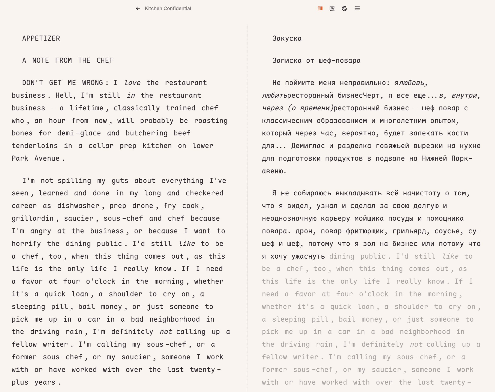
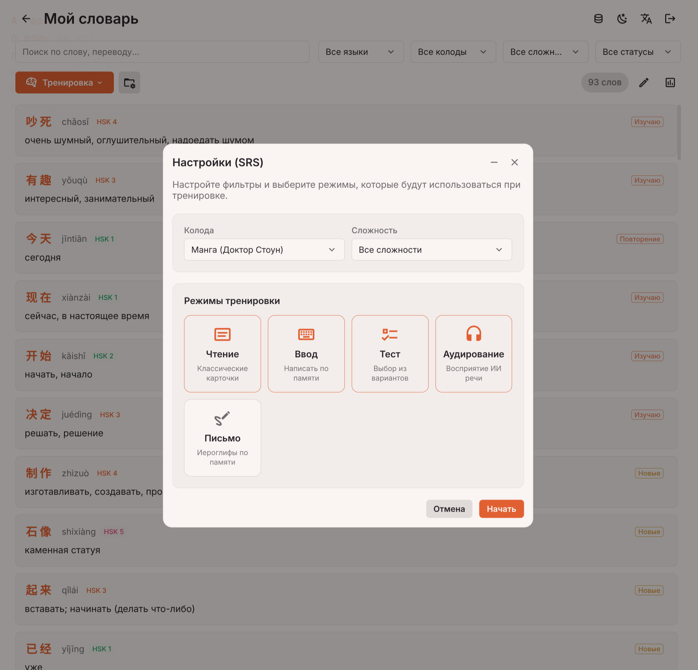

Бесшовные анимации через View Transitions API

Где это: Во всем приложении (переходы между страницами библиотеки, открытием словаря, переходом в режим читалки).

Как сейчас: Обычные CSS Transition (<Transition name="fade">).

Как круче: Использовать нативный View Transitions API. Во Vue Router это включается очень легко.
Например, при клике на обложку книги в библиотеке (book-card.vue), обложка может плавно увеличиться, перелететь в левый верхний угол и стать обложкой на странице book-info-view.vue. Это даст приложению ощущение дорогого, нативного iOS/Android приложения (особенно важно для PWA и Tauri).

# 🌍 Insight Book

**Insight Book** — это умная библиотека и EPUB/Манга-читалка, созданная специально для изучающих иностранные языки. Приложение не просто открывает книги, но и "понимает" их текст, разбивая его на слова, предоставляя контекстный ИИ-перевод, грамматический анализ и возможность прослушивания (TTS).


## ✨ Ключевые возможности

*   📖 **Умная читалка форматов (EPUB, FB2, CBZ, ZIP)**: Загружайте свои книги и комиксы. Приложение автоматически разобьет текст на страницы, извлечет оглавление, обложки и распознает текст с картинок (OCR).
*   🌐 **Поддержка OPDS-каталогов**: Подключайте любимые каталоги (Flibusta, Gutenberg и др.) и скачивайте книги прямо из интерфейса приложения.
*   🧠 **Глубокий ИИ-анализ (LLM)**: Выделите предложение или нажмите на слово, чтобы получить:
    *   Контекстный перевод.
    *   Разбор грамматических конструкций и генерацию примеров.
    *   Анализ сложной лексики и словосочетаний.
    *   Транскрипцию (IPA, Пиньинь, Ромадзи).
*   🎙️ **Интеллектуальная проверка произношения (STT)**: Записывайте свой голос прямо на карточке тренировки. Интегрированное STT-распознавание (Whisper) и ИИ-анализатор оценят точность произношения (в %), отобразят транскрипцию услышанного слова и укажут на конкретные фонетические ошибки (особенно актуально для тональных языков). Также доступно моментальное прослушивание своей записи.
*   🎓 **Тренировка слов (SRS)**: Встроенная система интервального повторения. Тренируйте добавленную лексику в разных режимах: *карточки, аудирование, тест, ввод с клавиатуры и **написание иероглифов по памяти***.
*   🗣️ **Озвучка текста (TTS)**: Слушайте правильное произношение отдельных слов или целых предложений.
*   🔤 **Поддержка сложных языков (NLP)**: Встроенные морфологические токенизаторы для правильного разбиения текста на слова:
    *   🇨🇳 **Китайский** (`nodejieba`)
    *   🇯🇵 **Японский** (`kuromoji`)
    *   🇬🇧 **Английский** (`compromise`)
    *   🇷🇺 **Русский** (`az`)
*   📊 **Анализ сложности книги, трекинг и статистика**: ИИ оценивает уровень сложности (например, HSK 4, B2) и собирает частотный словарь. Ваш ежедневный прогресс отображается на графике активности (Heatmap).
*   📈 **Прозрачный лог использования ИИ**: Панель статистики токенов детально отображает расходы входящих и исходящих данных, раздельно группируя вызовы по моделям и действиям (переводы, OCR, озвучка TTS и распознавание STT).
*   📓 **Личный словарь и колоды**: Сохраняйте незнакомые слова с контекстом, заметками и тегами в один клик. Распределяйте их по колодам. Доступен экспорт в **Anki**.
*   🎛️ **Кастомные LLM (BYOK)**: Пользователи могут указать свой API-ключ и URL (например, для локального `Ollama` или кастомного провайдера) прямо в настройках клиента.
*   ☁️ **Автоматические бэкапы (S3)**: Регулярное сохранение базы данных и файлов в S3-совместимое облако по расписанию.
*   📱 **Кроссплатформенность**: PWA для мобильных устройств, веб-версия и десктопное приложение (на базе Tauri).

## 🛠 Технологический стек

Проект представляет собой монорепозиторий (workspaces), управляемый с помощью **Bun**.

### Frontend (`apps/client`)
*   **Фреймворк:** Vue 3 (Composition API) + Vite
*   **Управление состоянием:** Pinia
*   **Стилизация:** SCSS (Кастомный UI Kit, Dark/Light темы)
*   **Архитектура:** Vertical Slice Architecture (VSA) — разбиение по фичам.
*   **Интерактив:** `@floating-ui/vue` (попапы), `hanzi-writer` (отрисовка иероглифов).
*   **PWA & Desktop:** `vite-plugin-pwa` + Workbox (оффлайн-режим) / Tauri.

### Backend (`apps/server`)
*   **Среда:** Bun (быстрый рантайм для TypeScript)
*   **База данных:** SQLite + Drizzle ORM
*   **Парсинг:** `epub2`, `node-html-parser`, `adm-zip`, `cheerio`.
*   **ИИ интеграция:** AI SDK (совместимость с OpenAI API, работает с Gemini, ChatGPT, Ollama и др. для анализа, TTS, STT и OCR).

---

## 🚀 Развертывание (Docker)

Для развертывания проекта используется готовый compose-файл.

### 1. Подготовка `.env` файла
Создайте файл `.env` в **корне проекта**. Вы можете скопировать содержимое из `apps/server/.env.example` и адаптировать его.

**Пример `.env` файла:**
```env
# Обязательно: API ключ для доступа к LLM (например, OpenAI, Gemini, etc.)
LLM_API_KEY=sk-xxxxxxxxxxxxxxxxxxxxxxxxxxxxxxxx

# URL эндпоинта, совместимого с OpenAI API
LLM_API_URL=https://aihubmix.com/v1

# Модели для анализа текста (основная и запасная)
LLM_MODEL=gemini-3.1-flash-lite
LLM_FALLBACK_MODEL=gpt-4o-mini

# TTS — синтез речи (основная и запасная модель)
TTS_API_KEY=
TTS_API_URL=
TTS_MODEL=gemini-2.5-flash-preview-tts
TTS_FALLBACK_MODEL=gpt-4o-mini-tts

# STT — распознавание речи (основная и запасная модель)
STT_API_KEY=
STT_API_URL=
STT_MODEL=whisper-large-v3
STT_FALLBACK_MODEL=whisper-large-v3-turbo

# OCR — распознавание текста на изображениях (основная + уточняющая модель)
OCR_API_KEY=
OCR_API_URL=
OCR_MODEL=glm-ocr
OCR_REFINEMENT_MODEL=gemini-3.1-flash-lite

# --- Авторизация и пользователи ---
# 'single' - вход без пароля (для локального использования)
# 'multi' - многопользовательский режим с окном входа
AUTH_MODE=multi

# Секрет для генерации JWT токенов (обязательно измените для продакшена!)
JWT_SECRET=super-secret-key

# Учетные данные первого администратора (создается автоматически при первом запуске)
ADMIN_USERNAME=admin
ADMIN_PASSWORD=admin_super_password

# --- Резервное копирование в S3 (Опционально) ---
ENABLE_AUTO_DUMP=false
S3_BUCKET=insight-book-bucket
S3_REGION=default
S3_ENDPOINT=
S3_ACCESS_KEY=
S3_SECRET_KEY=
```

### 2. Запуск
Выполните команду для сборки и запуска контейнеров:

```bash
docker compose -f ./docker/docker-compose.local.yml up -d --build
```

### 3. Использование
После успешной сборки приложение будет доступно по адресам:
*   **Клиент (Интерфейс):** [http://localhost:3334](http://localhost:3334)
*   **Сервер (API):** [http://localhost:4445](http://localhost:4445)

> База данных (`insight-book.sqlite`) и загруженные книги сохраняются в локальных папках `./db` и `./uploads` в корне проекта.

---

## 👥 Управление через CLI

### Пользователи
В целях безопасности открытая регистрация отключена. При `AUTH_MODE=multi`, управлять пользователями может только администратор через встроенную CLI утилиту сервера.

Выполняйте команды в контейнере сервера:

**Посмотреть список всех пользователей:**
```bash
docker exec -it docker-insight-book-server-1 bun ./src/cli.ts list
```

**Добавить нового пользователя:**
```bash
docker exec -it docker-insight-book-server-1 bun ./src/cli.ts add <логин> <пароль>
```

**Сменить пароль (в том числе администратору):**
```bash
docker exec -it docker-insight-book-server-1 bun ./src/cli.ts passwd <логин> <новый_пароль>
```

### Бэкапы (S3 Dumps)
При настроенном S3 вы можете вручную управлять дампами:
```bash
# Создать и загрузить дамп БД и файлов вручную
docker exec -it docker-insight-book-server-1 bun run dump:create

# Восстановить БД и файлы из последнего дампа S3
docker exec -it docker-insight-book-server-1 bun run dump:seed
```

---

## 📴 (Опционально) Офлайн-словари

Приложение умеет работать с локальными базами словарей для **мгновенного перевода** (без обращения к нейросети). Добавьте готовые файлы словарей в папку `db/dicts/`.

> **Требования:** файлы должны иметь расширение `.sqlite` (например, `dict_en_ru.sqlite`, `dict_zh_ru.sqlite`) и содержать таблицу `words` (поля `word`, `transcription`, `translation`).

Примеры скриптов для парсинга форматов словарей находятся в папках рабочих пространств:
- `tools/zh-dict-parser` — 🇨🇳 Китайский (Большой китайско-русский словарь)
- `tools/en-dict-parser` — 🇬🇧 Английский (Мюллер)
- `tools/jp-dict-parser` — 🇯🇵 Японский (Warodai)

---

## 📚 (Опционально) CLI-Парсер Манги

В репозитории есть встроенный инструмент `manhuagui-parser` для автоматического скачивания манги с `manhuagui.com`.
Парсер использует `Puppeteer`, обходит защиту и автоматически конвертирует скачанное в `.cbz` архив (с метаданными для ридера), который можно сразу загружать в Insight Book.

```bash
bun --cwd ./tools/manhuagui-parser run start
# Или сразу передать ссылку:
bun --cwd ./tools/manhuagui-parser run start https://www.manhuagui.com/comic/12345/
```

---

## 📸 Примеры экранов




